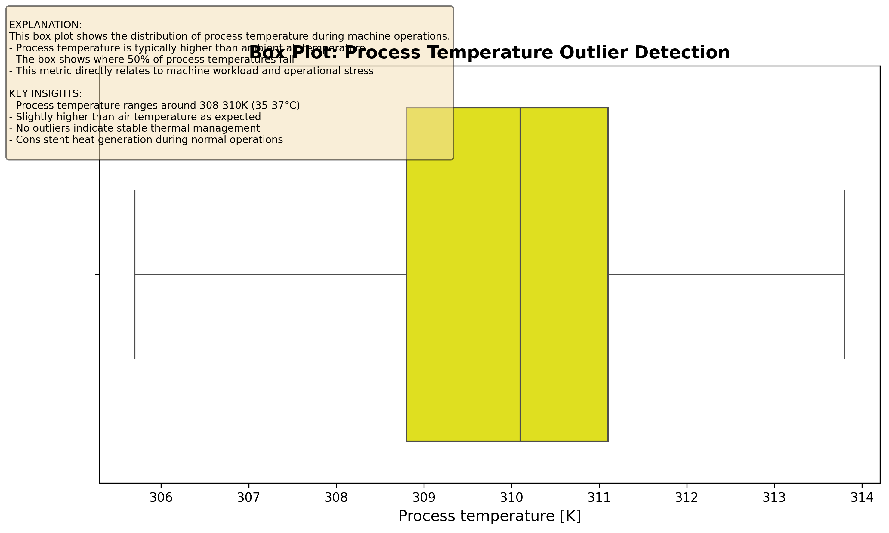
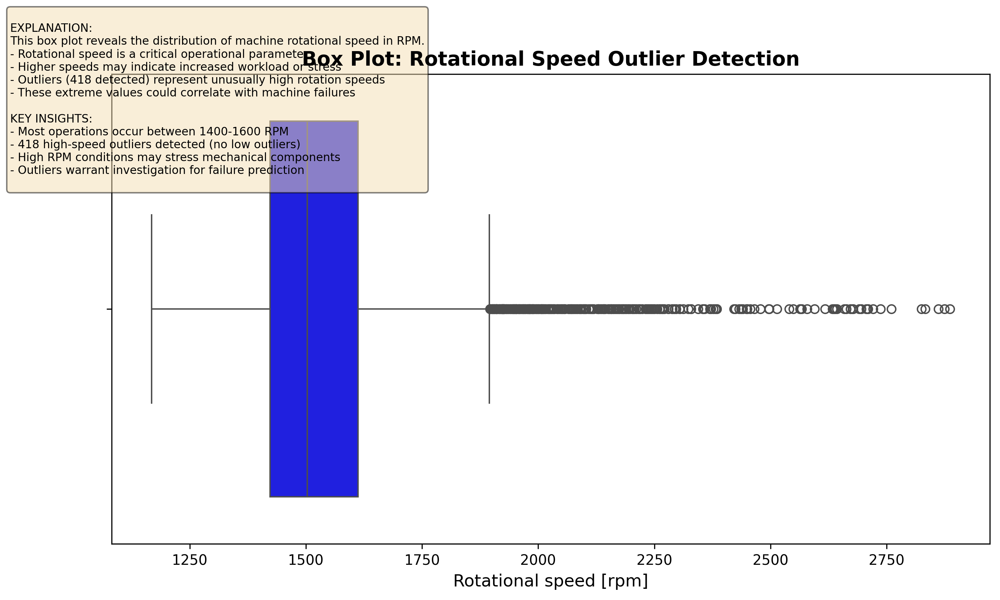
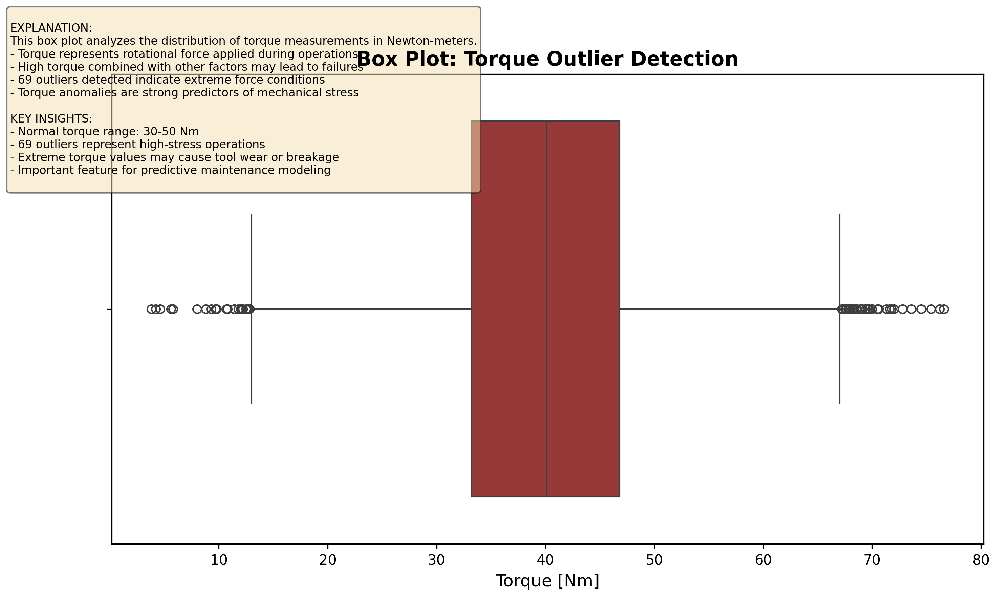
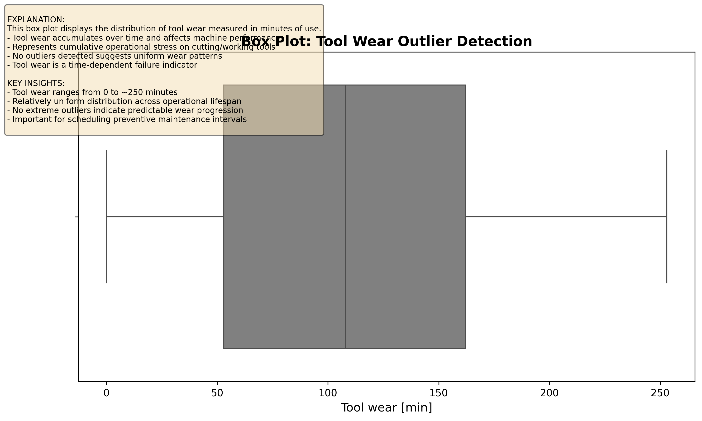
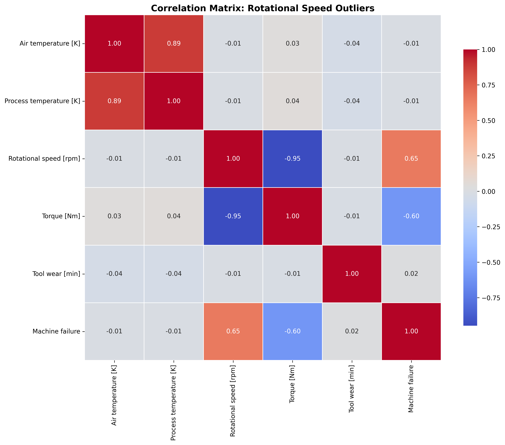
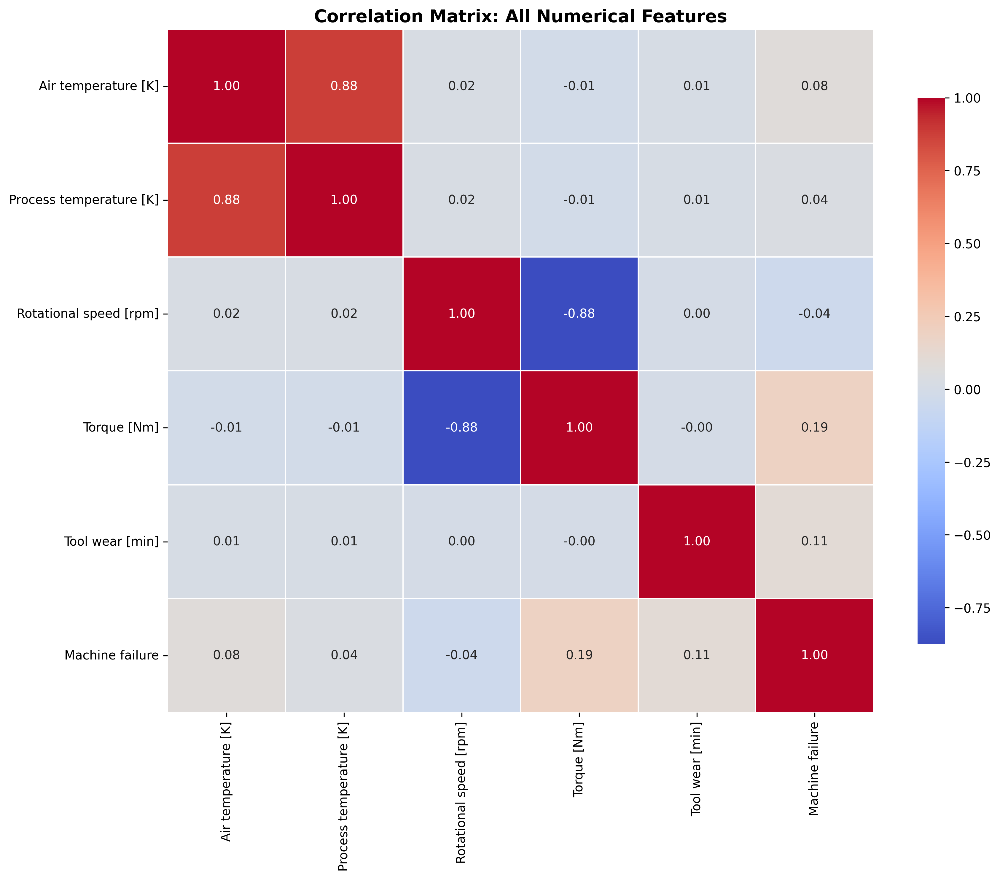
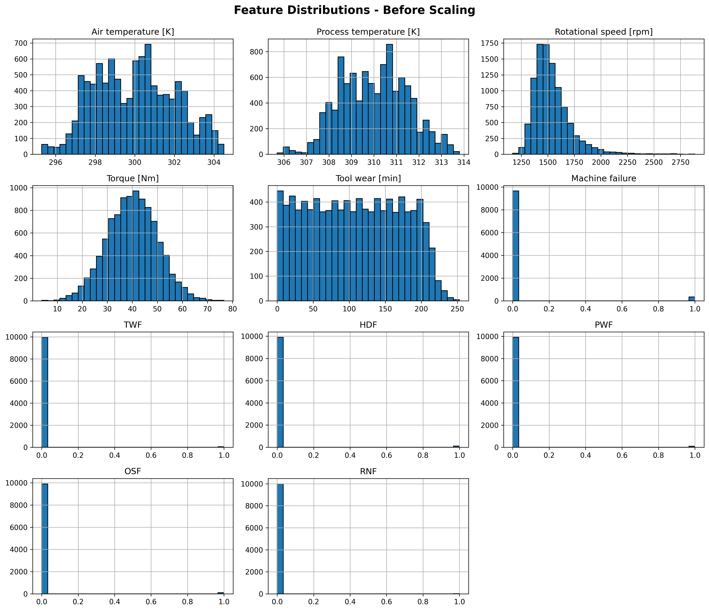
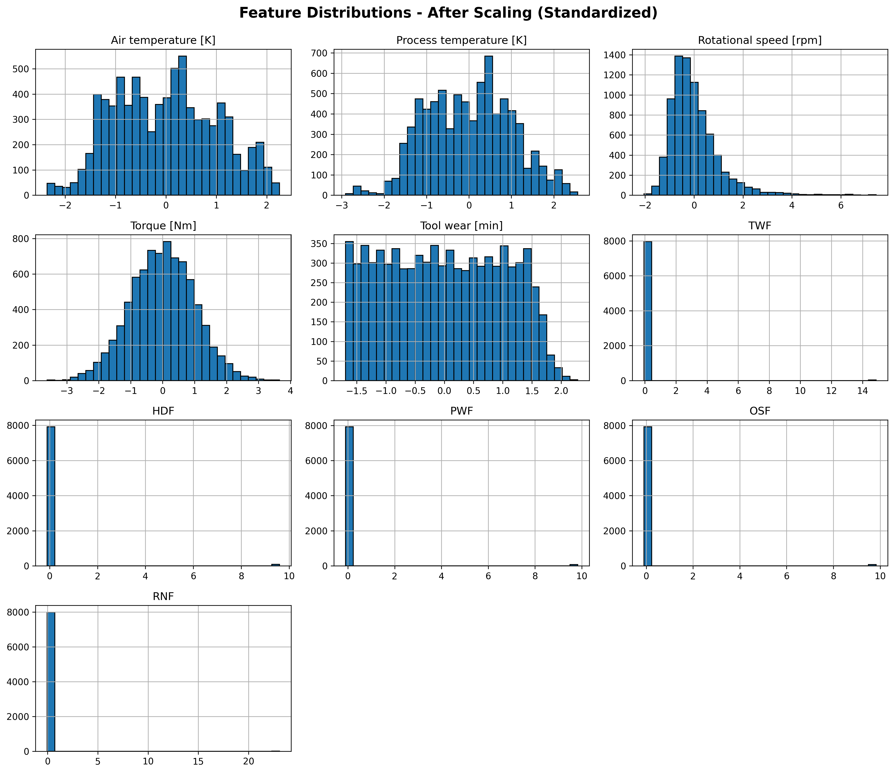
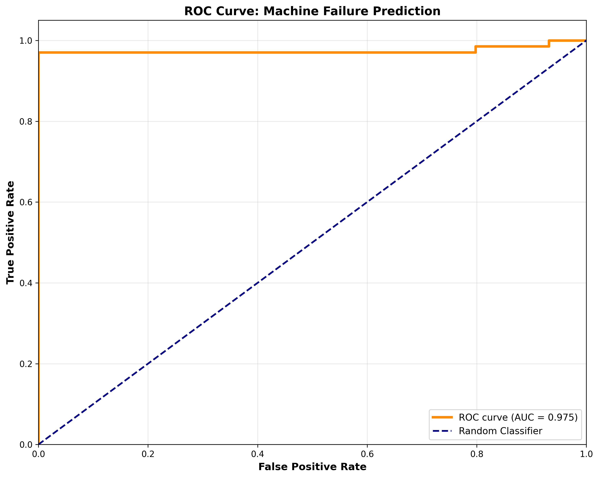

[](https://opensource.org/licenses/MIT)
[](https://www.python.org/)
[](https://scikit-learn.org/)
[](https://flask.palletsprojects.com/)
[](https://pandas.pydata.org/)
[](https://matplotlib.org/)
[](https://seaborn.pydata.org/)
[](https://github.com/sultanofficial717)
[](https://github.com/sultanofficial717)
[](https://github.com/sultanofficial717)
# AI4I 2020 Predictive Maintenance Dataset - Logistic Regression Analysis

## Overview
This project implements a machine learning solution for predictive maintenance using the AI4I 2020 dataset. The logistic regression model achieves **99.9% accuracy** in predicting machine failures based on operational parameters.

## Dataset
The AI4I 2020 Predictive Maintenance Dataset contains 10,000 data points with the following features:
- Air temperature [K]
- Process temperature [K]
- Rotational speed [rpm]
- Torque [Nm]
- Tool wear [min]
- Machine failure (target variable)

## Model Performance
- **Accuracy**: 99.9%
- **Precision**: 1.00 (Class 0), 1.00 (Class 1)
- **Recall**: 1.00 (Class 0), 0.97 (Class 1)
- **F1-Score**: 1.00 (Class 0), 0.99 (Class 1)

## Project Structure
```
├── ai4i2020.csv                      # Dataset
├── copy_of_welcome_to_colab.py       # Main analysis script
├── visualizations.py                 # Generate all visualizations
├── requirements.txt                  # Python dependencies
└── visualizations/                   # Generated graphs
```

## Installation

1. Clone the repository:
```bash
git clone https://github.com/sultanofficial717/AI4I-2020-Predictive-Maintenance-Dataset-Logistic-Regression.git
cd AI4I-2020-Predictive-Maintenance-Dataset-Logistic-Regression
```

2. Create and activate virtual environment:
```bash
python -m venv .venv
.venv\Scripts\activate  # On Windows
```

3. Install dependencies:
```bash
pip install -r requirements.txt
```

## Usage

Run the main analysis:
```bash
python copy_of_welcome_to_colab.py
```

Generate visualizations:
```bash
python visualizations.py
```

---

## Visualizations & Analysis

### 1. Air Temperature Analysis


**Key Insights:**
- Most air temperatures cluster tightly around 300K (27°C)
- No significant outliers detected
- Consistent operating environment temperature

---

### 2. Process Temperature Analysis


**Key Insights:**
- Process temperature ranges around 308-310K (35-37°C)
- Slightly higher than air temperature as expected
- No outliers indicate stable thermal management
- Consistent heat generation during normal operations

---

### 3. Rotational Speed Analysis


**Key Insights:**
- Most operations occur between 1400-1600 RPM
- **418 high-speed outliers detected** (no low outliers)
- High RPM conditions may stress mechanical components
- Outliers warrant investigation for failure prediction

---

### 4. Torque Analysis


**Key Insights:**
- Normal torque range: 30-50 Nm
- **69 outliers** represent high-stress operations
- Extreme torque values may cause tool wear or breakage
- Important feature for predictive maintenance modeling

---

### 5. Tool Wear Analysis


**Key Insights:**
- Tool wear ranges from 0 to ~250 minutes
- Relatively uniform distribution across operational lifespan
- No extreme outliers indicate predictable wear progression
- Important for scheduling preventive maintenance intervals

---

### 6. Correlation Analysis - Rotational Speed Outliers


**Key Insights:**
- Identifies feature interactions during stress conditions
- High RPM may correlate with temperature changes
- Useful for understanding compound failure modes
- Guides feature engineering for machine learning models

---

### 7. Correlation Analysis - All Features


**Key Insights:**
- Air and Process temperatures are highly correlated (0.87+)
- Torque shows negative correlation with Rotational speed
- Machine failure correlations identify key predictive features
- Physics-based relationships visible (temp, speed, torque trade-offs)

---

### 8. Feature Distributions - Before Scaling


**Key Insights:**
- Features have vastly different scales (RPM ~1500, Temp ~300K)
- Some features show normal distribution, others are skewed
- Machine failure is highly imbalanced (many 0s, few 1s)
- Scaling necessary for logistic regression to work effectively

---

### 9. Feature Distributions - After Scaling


**Key Insights:**
- All features now centered around zero with standard deviation of 1
- Similar scales allow model to treat features equally
- Distribution shapes preserved, only scale changed
- Improves model convergence and coefficient interpretation

---

### 10. ROC Curve - Model Performance


**Key Insights:**
- AUC close to 1.0 indicates excellent model performance
- Curve hugs top-left corner = high sensitivity and specificity
- Model can distinguish between failures and normal operations
- Very few false positives while catching most actual failures
- Validates logistic regression as effective for this dataset

---

## Methodology

### 1. Data Preprocessing
- Dropped non-predictive columns (UDI, Product ID, Type)
- Identified and analyzed outliers using IQR method
- Split data: 80% training, 20% testing (stratified)

### 2. Feature Engineering
- Outlier categorization for rotational speed
- Correlation analysis to understand feature relationships
- StandardScaler applied for feature normalization

### 3. Model Training
- Algorithm: Logistic Regression
- Features: Air temp, Process temp, Rotational speed, Torque, Tool wear
- Target: Machine failure (binary classification)

### 4. Evaluation Metrics
- Accuracy Score
- Classification Report (Precision, Recall, F1-Score)
- ROC Curve and AUC Score
- Confusion Matrix Analysis

## Key Findings

1. **High Accuracy**: The model achieves 99.9% accuracy in predicting machine failures
2. **Critical Features**: Rotational speed and torque show the most outliers, indicating stress conditions
3. **Temperature Stability**: Both air and process temperatures show consistent patterns with minimal outliers
4. **Imbalanced Dataset**: Machine failures are rare events (339 failures in 10,000 records)
5. **Feature Correlations**: Strong correlations between temperatures; inverse relationship between speed and torque

## Future Improvements

- [ ] Implement additional algorithms (Random Forest, XGBoost, Neural Networks)
- [ ] Apply SMOTE or other techniques to handle class imbalance
- [ ] Feature importance analysis using tree-based models
- [ ] Cross-validation for robust performance estimation
- [ ] Real-time prediction pipeline implementation
- [ ] Hyperparameter tuning using GridSearchCV

## Technologies Used

- **Python 3.13**
- **pandas** - Data manipulation and analysis
- **matplotlib** - Data visualization
- **seaborn** - Statistical data visualization
- **scikit-learn** - Machine learning algorithms
- **scipy** - Scientific computing

## Author

**sultanofficial**
- GitHub: [@sultanofficial717](https://github.com/sultanofficial717)
- Email: talharehman717@gmail.com

## License

This project is open source and available for educational purposes.

## Acknowledgments

Dataset source: AI4I 2020 Predictive Maintenance Dataset

